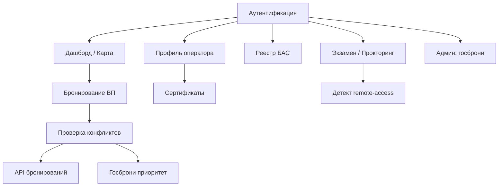
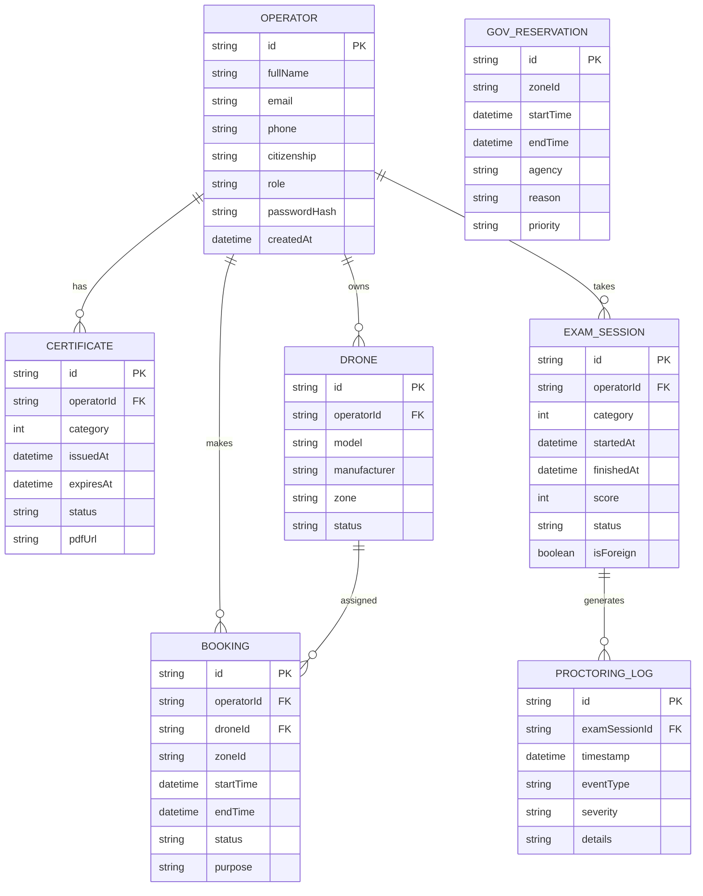

# ЕЦП БАС — Полная Архитектура Платформы

## Обзор модулей



## Файловая структура

```
drone/
├── index.html        ← SPA shell (все страницы)
├── style.css         ← стили всех модулей
├── config.js         ← конфигурация системы
├── api.js            ← Data Access Layer (расширенный)
├── state.js          ← State Manager
├── app.js            ← Main controller + роутинг
├── auth.js           ← Аутентификация (eGov, email, OTP)
├── booking.js        ← Карта + бронирование ВП
├── profile.js        ← Профиль оператора + сертификаты
├── exam.js           ← Экзамен + прокторинг
└── admin.js          ← Админ-панель госброней
```

---

## 1. Аутентификация (`auth.js`)

### Страница входа
- **eGov QR**: генерация QR-кода → сканирование eGov mobile → callback с токеном
- **Email**: поля email + пароль → валидация
- **Телефон**: ввод номера → отправка OTP (SMS/WhatsApp) → ввод кода

### Логика
```
login-page → выбор метода → ввод данных → проверка → redirect → dashboard
```

### Данные оператора при регистрации
- Уникальный ID: `OP-XXXXX`
- ФИО, гражданство, контакты
- Тип: `citizen` | `foreign`
- Роль: `operator` | `admin` | `gov`

---

## 2. Профиль оператора (`profile.js`)

### Разделы
| Раздел | Содержание |
|---|---|
| **Личные данные** | ФИО, ИИН/паспорт, гражданство, email, телефон, фото |
| **Сертификаты** | Таблица: категория, дата выдачи, срок, статус (активен/просрочен) |
| **Мои БАС** | Привязанные дроны из реестра |
| **История полётов** | Все бронирования: дата, зона, статус, длительность |
| **Документы** | Скачивание PDF сертификатов |

### Сертификаты
- Категории: 1 (базовая), 2 (продвинутая), 3 (профессиональная)
- Генерация PDF с QR-кодом для верификации по ID
- Проверка валидности: `certificate.expiresAt > now`

---

## 3. Дашборд — Карта и Бронирование (`booking.js`)

### Layout

```
┌─────────────────────────────────────────────────────────┐
│ ДАШБОРД           ● LIVE    Оператор: OP-12345          │
├──────────────────────────────────────┬──────────────────┤
│                                      │ БРОНИРОВАНИЕ     │
│         КАРТА (Leaflet)              │                  │
│                                      │ Место полёта:    │
│  [🟢свободно] [🟡занято] [🔴гос]    │ [___________]    │
│                                      │                  │
│  ┌──────────┐                       │ Время начала:    │
│  │ Зона G-7 │ ← кликабельная       │ [___________]    │
│  │ свободна  │                       │                  │
│  └──────────┘                       │ Время окончания: │
│                                      │ [___________]    │
│  ┌──────────┐                       │                  │
│  │ P-14     │ ← гос.бронь          │ Борт:            │
│  │ закрыта  │                       │ [___________]    │
│  └──────────┘                       │                  │
│                                      │ [ПРОВЕРИТЬ]      │
│                                      │ [ЗАБРОНИРОВАТЬ]  │
├──────────────────────────────────────┴──────────────────┤
│ Мои бронирования (список ниже карты)                    │
└─────────────────────────────────────────────────────────┘
```

### Логика проверки конфликтов
```javascript
API.bookings.checkConflict(zone, startTime, endTime) → {
    available: true/false,
    conflicts: [
        { type: 'operator', operatorId: 'OP-XXX', time: '...' },
        { type: 'government', agency: 'МО РК', reason: '...' }
    ]
}
```

### Цветовая кодировка зон на карте
| Цвет | Значение |
|---|---|
| 🟢 Зелёный | Свободно — можно бронировать |
| 🟡 Жёлтый | Занято другим оператором |
| 🔴 Красный | Гос. бронь — блокировано |
| 🟠 Оранжевый | Требует согласования с госорганом |
| 🔵 Синий | Ваша текущая бронь |

### Бронирование: два способа ввода
1. **Клик на карте** → выделение зоны → заполнение времени в боковой панели
2. **Ввод в полях** → адрес/координаты + время → подсветка зоны на карте

---

## 4. Экзамен и Прокторинг (`exam.js`)

### Процесс сдачи
```
Профиль → "Сдать экзамен на категорию 1" → Проверка прокторинга → Экзамен → Результат → Сертификат
```

### Страница экзамена
- Таймер обратного отсчёта
- Вопросы с вариантами ответов
- Индикатор прокторинга (камера, микрофон, статус)
- Кнопка «Завершить экзамен»

### Детектирование remote-access (браузерный)
```javascript
// Методы детекции:
1. Screen Capture API — getDisplayMedia() hook
2. Visibility API — document.hidden / visibilitychange
3. Focus detection — window.blur / focus events
4. Window size anomalies — innerWidth !== screen.width
5. DevTools detection — debugger trap + timing
6. Known process names — через user-agent / platform info
```

### Логирование
Каждое подозрительное событие → `ProctoringLog`:
- `timestamp`, `eventType`, `severity`, `details`
- При critical event → автоматическое прерывание экзамена

### Отдельный флоу для иностранцев
- Флаг `operator.citizenship !== 'KZ'` → другой набор вопросов
- Дистанционный формат с усиленным прокторингом
- Привязка к паспорту вместо ИИН

---

## 5. Сущности БД (API Layer)



---

## 6. Порядок реализации

### Фаза 1: Ядро
- [ ] `config.js` — расширить конфигурацию (экзамен, авторизация, зоны)
- [ ] `api.js` — добавить: operators, certificates, bookings, govReservations, exams, proctoringLogs
- [ ] `state.js` — добавить: currentUser, auth state

### Фаза 2: Аутентификация
- [ ] `auth.js` — страница входа с тремя методами
- [ ] Роутинг: незалогинен → login, залогинен → dashboard

### Фаза 3: Дашборд с картой
- [ ] `booking.js` — интерактивная карта + панель бронирования
- [ ] Проверка конфликтов (оператор × оператор, оператор × госбронь)
- [ ] Визуализация занятости зон по цветам

### Фаза 4: Профиль
- [ ] `profile.js` — личные данные, сертификаты, история, документы

### Фаза 5: Экзамен
- [ ] `exam.js` — интерфейс экзамена + прокторинг + детект remote-access

### Фаза 6: Админ
- [ ] `admin.js` — управление госбронями

## Verification

- Логин → дашборд с картой
- Клик на зону → бронирование → проверка конфликтов
- Профиль → сертификаты → скачивание PDF
- Экзамен → прокторинг → детект tab-switch → блокировка
- Госбронь → блокирует зону на карте красным
